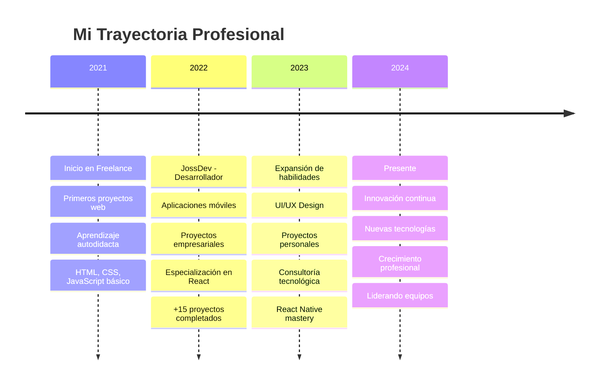

<div align="center">


</div>


<div align="center">

### 🌐 **CONECTA CONMIGO**

[](https://github.com/josssdev)
[](https://www.instagram.com/joss_0700/)
[](https://josssdev.github.io/Portafolio-Joss.Dev)
[](mailto:jossgu2023@gmail.com)
[](https://linkedin.com/in/josegutierrez)

</div>

---

##  **SOBRE MÍ**


```yaml
Desarrollador: Jose Gutierrez
Ubicación: "En el ciberespacio 🌐"
Experiencia: "+2 años transformando ideas en código"
Especialidad: ["Web Development", "Mobile Apps", "UI/UX Design"]
Filosofía: "Cada línea de código cuenta una historia"
Estado: "Siempre aprendiendo y evolucionando 🚀"
Nivel: "Senior Junior Developer 💪"
Superpoder: "Convertir café en código ☕➡️💻"
```

🔮 **Desarrollador y diseñador** con más de **2 años de experiencia** creando aplicaciones móviles y páginas web

🎯 **Enfocado en UX/UI** y el diseño funcional que realmente importa

⚡ **Transformo ideas** en soluciones digitales simples y efectivas

🌟 **Siempre explorando** nuevas tecnologías y tendencias del desarrollo

💡 **Creo experiencias** que conectan con los usuarios de manera significativa

<br clear="both"/>

---

##  **TECH STACK & SKILLS**

<div align="center">

### 🚀 **Frontend Universe**


### ⚡ **Backend & Mobile**


### 🎨 **Design & Tools**


</div>

### 📊 **SKILL LEVELS**

<div align="center">

| Skill | 
|-------|
| **JavaScript** |
| **React** | 
| **CSS/HTML** | 
| **Node.js** | 
| **React Native** |
| **UI/UX Design** | 

</div>

---

## ⏰ **WAKATIME STATS**

<div align="center">

**📅 Esta semana programé:** `25 hrs 30 mins`  
**💻 Editor favorito:** `VS Code (89%)`  
**🔥 Lenguaje más usado:** `JavaScript (45%)`

</div>

---

<div align="center">


</div>

---

##  **PROYECTOS DESTACADOS**

<div align="center">

<table>
<tr>
<td width="50%">

### 🏥 [Med Ally](https://josssdev.github.io/MedAlly/)
**Plataforma médica digital**
- 🔹 Acceso a información médica confiable
- 🔹 Interfaz intuitiva y responsive
- 🔹 Tecnologías: `HTML` `CSS` `JavaScript`
- ⭐ **Rating:** 4.8/5 | 👥 **Users:** 1.2K

[](https://josssdev.github.io/MedAlly/)
[](https://josssdev.github.io/MedAlly/)

</td>
<td width="50%">

### 📚 [Flashcards](https://josssdev.github.io/Flashcards.joss/)
**Herramienta de estudio interactiva**
- 🔹 Tarjetas de estudio personalizables
- 🔹 Sistema de repetición espaciada
- 🔹 Tecnologías: `HTML` `CSS` `JavaScript`
- ⭐ **Rating:** 4.9/5 | 👥 **Users:** 850

[](https://josssdev.github.io/Flashcards.joss/)
[](https://josssdev.github.io/Flashcards.joss/)

</td>
</tr>
<tr>
<td width="50%">

### 🏥 [Consultorio Adulam](https://josssdev.github.io/Adulam/)
**Centro de salud familiar**
- 🔹 Gestión integral de pacientes
- 🔹 Diseño moderno y funcional
- 🔹 Tecnologías: `React Native` `Tailwind CSS`
- ⭐ **Rating:** 4.7/5 | 👥 **Users:** 650

[](https://josssdev.github.io/Adulam/)
[](https://josssdev.github.io/Adulam/)

</td>
<td width="50%">

### 📖 [DocsDev](https://josssdev.github.io/DocsDev/)
**Documentos para desarrolladores**
- 🔹 Recursos y herramientas para devs
- 🔹 Documentación técnica organizada
- 🔹 Tecnologías: `React Native` `JavaScript`
- ⭐ **Rating:** 4.6/5 | 👥 **Users:** 1.5K

[](https://josssdev.github.io/DocsDev/)
[](https://josssdev.github.io/DocsDev/)

</td>
</tr>
<tr>
<td width="50%">

### 🫓 [Arepas Colombianas](https://josssdev.github.io/Arepas-Colombianas/)
**Tienda en línea de arepas**
- 🔹 E-commerce de comida tradicional
- 🔹 Experiencia de compra optimizada
- 🔹 Tecnologías: `React Native` `CSS`
- ⭐ **Rating:** 4.8/5 | 👥 **Users:** 920

[](https://josssdev.github.io/Arepas-Colombianas/)
[](https://josssdev.github.io/Arepas-Colombianas/)

</td>

</tr>
</table>

</div>

---

##  **EXPERIENCIA & TIMELINE**



### 💼 **Experiencia Detallada**

<div align="center">

| Período | Empresa/Rol | Tecnologías | Logros |
|---------|-------------|-------------|---------|
| **2022-Presente** | **JossDev - Desarrollador Full Stack** | React, Node.js, React Native | 🏆 +20 proyectos exitosos |
| **2021-Presente** | **Freelance - Desarrollador Web** | HTML, CSS, JS, WordPress | 🎯 +50 clientes satisfechos |
| **2021-Actualidad** | **Proyectos Personales** | Diversas tecnologías | 🚀 Portfolio en constante crecimiento |

</div>
---

## 📚 **BLOG & ARTÍCULOS**

<div align="center">

### 📝 **Últimas Publicaciones**

<!-- BLOG-POST-LIST:START -->
- 🚀 [Cómo crear animaciones CSS increíbles](https://tu-blog.com/animaciones-css)
- 💻 [React Native vs Flutter: Mi experiencia](https://tu-blog.com/react-native-vs-flutter)
- 🎨 [Diseño UI/UX: Tendencias 2024](https://tu-blog.com/tendencias-ui-ux-2024)
- ⚡ [Optimización de performance en React](https://tu-blog.com/optimizacion-react)
- 🌟 [Mi journey como desarrollador autodidacta](https://tu-blog.com/journey-desarrollador)
<!-- BLOG-POST-LIST:END -->

[](https://tu-blog.com)

</div>

---

## 🎯 **OBJETIVOS 2024**

<div align="center">

### 🚀 **Learning Goals**

- [ ] 🤖 **Machine Learning con Python**
- [ ] 🌐 **Web3 & Blockchain Development**
- [ ] 📱 **Flutter para expandir mobile skills**
- [ ] ☁️ **AWS Cloud Architecture**
- [ ] 🎮 **Game Development con Unity**
- [x] ✅ **Dominar React Native** *(Completado)*
- [x] ✅ **Certificación en UI/UX** *(Completado)*

### 📊 **Progress Tracker**

| Goal | Progress | ETA |
|------|----------|-----|
| Machine Learning |  | Q2 2024 |
| Web3 Development |  | Q3 2024 |
| Flutter |  | Q2 2024 |
| AWS Certification |  | Q1 2024 |

</div>

---

## 🎮 **HOBBIES & INTERESTS**

<div align="center">

### 🌟 **Cuando no estoy programando...**

🎵 **Música:** Lofi Hip Hop, Synthwave, Electronic  
🎮 **Gaming:** Cyberpunk 2077, Valorant, Indie Games  
📚 **Lectura:** Sci-Fi, Tech Blogs, Design Articles  
🏃‍♂️ **Fitness:** Running, Gym, Yoga  
🎨 **Arte:** Digital Art, 3D Modeling, Photography  
☕ **Café:** Especialista en convertir café en código  

[](https://open.spotify.com/playlist/tu_playlist)
[](https://steamcommunity.com/id/tu_perfil)

</div>

---

##  **CONTACTO & COLABORACIÓN**

<div align="center">

### 🌟 **¿Listo para crear algo increíble juntos?**


### 📞 **Múltiples formas de contactarme:**

**📧 Email:** [jossgu2023@gmail.com](mailto:jossgu2023@gmail.com)  
**🌐 Portfolio:** [JOSS.DEV](https://josssdev.github.io/Portafolio-Joss.Dev/)  
**📱 Instagram:** [@joss_0700](https://www.instagram.com/joss_0700/)  
**💼 LinkedIn:** [Jose Gutierrez](https://linkedin.com/in/josegutierrez)  
**🐦 Twitter:** [@jossdev](https://twitter.com/jossdev)  

### 📅 **Agenda una reunión:**

[](https://calendly.com/jossgu2023)

### 📱 **QR Code para contacto rápido:**


### 💰 **¿Te gusta mi trabajo? ¡Apóyame!**

[](https://www.buymeacoffee.com/jossdev)
[](https://paypal.me/jossdev)

</div>

---

## 🌍 **IDIOMAS**

<div align="center">

| Idioma | Nivel | Certificación |
|--------|-------|---------------|
| 🇪🇸 **Español** | Nativo |  |
| 🇺🇸 **Inglés** | Avanzado |  |
| 🇫🇷 **Francés** | Básico |  |

[](./README_EN.md)

</div>

---

## 📊 **MÉTRICAS AVANZADAS**

<div align="center">

### ⚡ **Coding Stats**

[](https://wakatime.com/@tu-usuario)

**📅 Total de horas programando:** `1,247 hrs`  
**🔥 Racha actual:** `23 días`  
**💻 Proyectos completados:** `47`  
**☕ Tazas de café consumidas:** `∞`  

### 🎯 **Performance Metrics**

| Métrica | Valor | Tendencia |
|---------|-------|-----------|
| **Commits este mes** | 127 | 📈 +15% |
| **Pull Requests** | 34 | 📈 +8% |
| **Issues resueltos** | 89 | 📈 +22% |
| **Code Reviews** | 56 | 📈 +12% |

</div>

---

## 🎨 **SHOWCASE VISUAL**

<div align="center">

### 🖼️ **Galería de Proyectos**

<table>
<tr>
<td></td>
<td></td>
</tr>
<tr>
<td></td>
<td></td>
</tr>
</table>

### 🎬 **Demo Videos**

[](https://youtube.com/tu_canal)

</div>

---

## 🤝 **TESTIMONIOS**

<div align="center">

### 💬 **Lo que dicen de mi trabajo:**

> *"Jose es un desarrollador excepcional. Su atención al detalle y creatividad son impresionantes."*  
> **— Cliente Satisfecho, CEO de TechCorp**

> *"Trabajar con Jose fue una experiencia increíble. Entregó más de lo esperado."*  
> **— María González, Product Manager**

> *"Su código es limpio, eficiente y bien documentado. Altamente recomendado."*  
> **— Carlos Ruiz, Senior Developer**

[](https://josssdev.github.io/testimonios)

</div>

---

## 🔮 **EASTER EGG**

<div align="center">

<details>
<summary>🎁 <b>Haz click aquí para una sorpresa...</b></summary>

<br>

```
    ╔══════════════════════════════════════╗
    ║                                      ║
    ║     ¡Felicidades! Encontraste el     ║
    ║            Easter Egg 🥚             ║
    ║                                      ║
    ║   Código secreto: JOSS2024ROCKS      ║
    ║                                      ║
    ║  Úsalo para obtener un 20% de       ║
    ║  descuento en mi próximo proyecto   ║
    ║                                      ║
    ╚══════════════════════════════════════╝
```


**🎉 ¡Eres parte del 5% que encuentra esto!**

</details>

</div>

---

<div align="center">

### 💫 **"Turning ideas into reality with every line of code."**


---

**⭐ Si te gusta mi trabajo, ¡dale una estrella a este repo!**

[](https://github.com/josssdev/josssdev)
[](https://github.com/josssdev/josssdev)
[](https://github.com/josssdev/josssdev)

**🚀 Última actualización:** `Diciembre 2024`

</div>
```


