<div align="center">


</div>


<div align="center">

### 🌐 **CONECTA CONMIGO**

[](https://github.com/josssdev)
[](https://www.instagram.com/joss_0700/)
[](https://josssdev.github.io/Portafolio-Joss.Dev)
[](mailto:jossgu2023@gmail.com)
[](https://linkedin.com/in/josegutierrez)

</div>


##  **SOBRE MÍ**


```yaml
Desarrollador: Jose Gutierrez
Ubicación: "En el ciberespacio 🌐"
Experiencia: "+2 años transformando ideas en código"
Especialidad: ["Web Development", "Mobile Apps", "UI/UX Design"]
Filosofía: "Cada línea de código cuenta una historia"
Estado: "Siempre aprendiendo y evolucionando 🚀"
Nivel: "Senior Junior Developer 💪"
Superpoder: "Convertir café en código ☕➡️💻"
```

🔮 **Desarrollador y diseñador** con más de **2 años de experiencia** creando aplicaciones móviles y páginas web

🎯 **Enfocado en UX/UI** y el diseño funcional que realmente importa

⚡ **Transformo ideas** en soluciones digitales simples y efectivas

🌟 **Siempre explorando** nuevas tecnologías y tendencias del desarrollo

💡 **Creo experiencias** que conectan con los usuarios de manera significativa

<br clear="both"/>

---

##  **TECH STACK & SKILLS**

<div align="center">

### 🚀 **Frontend Universe**


### ⚡ **Backend & Mobile**


### 🎨 **Design & Tools**


</div>

### 📊 **SKILL LEVELS**

<div align="center">

| Skill | 
|-------|
| **JavaScript** |
| **React** | 
| **CSS/HTML** | 
| **Node.js** | 
| **React Native** |
| **UI/UX Design** | 

</div>

---

## ⏰ **WAKATIME STATS**

<div align="center">

**📅 Esta semana programé:** `25 hrs 30 mins`  
**💻 Editor favorito:** `VS Code (89%)`  
**🔥 Lenguaje más usado:** `JavaScript (45%)`

</div>

---

<div align="center">


</div>

---

##  **PROYECTOS DESTACADOS**

<div align="center">

<table>
<tr>
<td width="50%">

### 🏥 [Med Ally](https://josssdev.github.io/MedAlly/)
**Plataforma médica digital**
- 🔹 Acceso a información médica confiable
- 🔹 Interfaz intuitiva y responsive
- 🔹 Tecnologías: `HTML` `CSS` `JavaScript`
- ⭐ **Rating:** 4.8/5 | 👥 **Users:** 1.2K

[](https://josssdev.github.io/MedAlly/)
[](https://josssdev.github.io/MedAlly/)

</td>
<td width="50%">

### 📚 [Flashcards](https://josssdev.github.io/Flashcards.joss/)
**Herramienta de estudio interactiva**
- 🔹 Tarjetas de estudio personalizables
- 🔹 Sistema de repetición espaciada
- 🔹 Tecnologías: `HTML` `CSS` `JavaScript`
- ⭐ **Rating:** 4.9/5 | 👥 **Users:** 850

[](https://josssdev.github.io/Flashcards.joss/)
[](https://josssdev.github.io/Flashcards.joss/)

</td>
</tr>
<tr>
<td width="50%">

### 🏥 [Consultorio Adulam](https://josssdev.github.io/Adulam/)
**Centro de salud familiar**
- 🔹 Gestión integral de pacientes
- 🔹 Diseño moderno y funcional
- 🔹 Tecnologías: `React Native` `Tailwind CSS`
- ⭐ **Rating:** 4.7/5 | 👥 **Users:** 650

[](https://josssdev.github.io/Adulam/)
[](https://josssdev.github.io/Adulam/)

</td>
<td width="50%">

### 📖 [DocsDev](https://josssdev.github.io/DocsDev/)
**Documentos para desarrolladores**
- 🔹 Recursos y herramientas para devs
- 🔹 Documentación técnica organizada
- 🔹 Tecnologías: `React Native` `JavaScript`
- ⭐ **Rating:** 4.6/5 | 👥 **Users:** 1.5K

[](https://josssdev.github.io/DocsDev/)
[](https://josssdev.github.io/DocsDev/)

</td>
</tr>
<tr>
<td width="50%">

### 🫓 [Arepas Colombianas](https://josssdev.github.io/Arepas-Colombianas/)
**Tienda en línea de arepas**
- 🔹 E-commerce de comida tradicional
- 🔹 Experiencia de compra optimizada
- 🔹 Tecnologías: `React Native` `CSS`
- ⭐ **Rating:** 4.8/5 | 👥 **Users:** 920

[](https://josssdev.github.io/Arepas-Colombianas/)
[](https://josssdev.github.io/Arepas-Colombianas/)

</td>

</tr>
</table>

</div>

---

##  **EXPERIENCIA & TIMELINE**



```mermaid
timeline
    title Mi Trayectoria Profesional
    
    2021 : Inicio en Freelance
         : Primeros proyectos web
         : Aprendizaje autodidacta
         : HTML, CSS, JavaScript básico
    
    2022 : JossDev - Desarrollador
         : Aplicaciones móviles
         : Proyectos empresariales
         : Especialización en React
         : +15 proyectos completados
    
    2023 : Expansión de habilidades
         : UI/UX Design
         : Proyectos personales
         : Consultoría tecnológica
         : React Native mastery
    
    2024 : Presente
         : Innovación continua
         : Nuevas tecnologías
         : Crecimiento profesional
         : Liderando equipos
```

### 💼 **Experiencia Detallada**

<div align="center">

| Período | Empresa/Rol | Tecnologías | Logros |
|---------|-------------|-------------|---------|
| **2022-Presente** | **JossDev - Desarrollador Full Stack** | React, Node.js, React Native | 🏆 +20 proyectos exitosos |
| **2021-Presente** | **Freelance - Desarrollador Web** | HTML, CSS, JS, WordPress | 🎯 +50 clientes satisfechos |
| **2021-Actualidad** | **Proyectos Personales** | Diversas tecnologías | 🚀 Portfolio en constante crecimiento |

</div>
---

##  **CONTACTO & COLABORACIÓN**

<div align="center">

### 🌟 **¿Listo para crear algo increíble juntos?**


### 📞 **Múltiples formas de contactarme:**

**📧 Email:** [jossgu2023@gmail.com](mailto:jossgu2023@gmail.com)  
**🌐 Portfolio:** [JOSS.DEV](https://josssdev.github.io/Portafolio-Joss.Dev/)  
**📱 Instagram:** [@joss_0700](https://www.instagram.com/joss_0700/)  
**💼 LinkedIn:** [Jose Gutierrez](https://linkedin.com/in/josegutierrez) 

### 📅 **Agenda una reunión:**

[](https://calendly.com/jossgu2023)


### 💰 **¿Te gusta mi trabajo? ¡Apóyame!**

[](https://paypal.me/jossdev)

</div>

---

## 🎨 **SHOWCASE VISUAL**

<div align="center">

### 🖼️ **Galería de Proyectos**

<table>
<tr>
<td></td>
<td></td>
</tr>
<tr>
<td></td>
<td></td>
</tr>
</table>

</div>
---

<div align="center">

### 💫 **"Turning ideas into reality with every line of code."**


---

**⭐ Si te gusta mi trabajo, ¡dale una estrella a este repo!**

[](https://github.com/josssdev/josssdev)
[](https://github.com/josssdev/josssdev)
[](https://github.com/josssdev/josssdev)

**🚀 Última actualización:** `Julio 2025`

</div>
```


